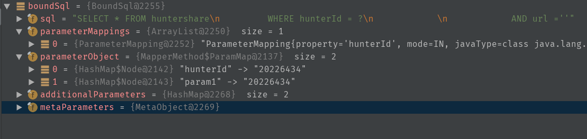

* content
{:toc}

---

# mybatis源码解读之答疑
我认为阅读源码最好的方式是带着问题去阅读，在过程中解决疑惑，也可以学习下设计，代码的组织结构等等，其乐无穷啊。下面我就将阅读源码之后解决的问题都列出来，以供复习回忆，就不一一分析源代码了，Mybatis 的源码还是很简洁易懂的。


**mybatis如何处理结果集映射(resultMap和resultSet)以及延迟加载？**

在`DefaultResultSetHandler`中`handleResultSet`中
```java
private void handleResultSet(ResultSetWrapper rsw, ResultMap resultMap, List<Object> multipleResults, ResultMapping parentMapping) throws SQLException {
   try {
     if (parentMapping != null) {
       handleRowValues(rsw, resultMap, null, RowBounds.DEFAULT, parentMapping);
     } else {
       if (resultHandler == null) {
         DefaultResultHandler defaultResultHandler = new DefaultResultHandler(objectFactory);
         handleRowValues(rsw, resultMap, defaultResultHandler, rowBounds, null);
         multipleResults.add(defaultResultHandler.getResultList());
       } else {
         handleRowValues(rsw, resultMap, resultHandler, rowBounds, null);
       }
     }
   } finally {
     // issue #228 (close resultsets)
     closeResultSet(rsw.getResultSet());
   }
 }
```
如果是简单的resultMap(没有内联的resultMap/resultType)，进入else语句
跟进去代码最终里层处理是在这边

```java
private boolean applyPropertyMappings(ResultSetWrapper rsw, ResultMap resultMap, MetaObject metaObject, ResultLoaderMap lazyLoader, String columnPrefix)
     throws SQLException {
   final List<String> mappedColumnNames = rsw.getMappedColumnNames(resultMap, columnPrefix);
   boolean foundValues = false;

   获取配置的resultMap里面每个result的信息，包括列名，字段名，对应的typeHandler(解析resultMap的时候生成进去的),
   final List<ResultMapping> propertyMappings = resultMap.getPropertyResultMappings();
   for (ResultMapping propertyMapping : propertyMappings) {
     String column = prependPrefix(propertyMapping.getColumn(), columnPrefix);
     if (propertyMapping.getNestedResultMapId() != null) {
       // the user added a column attribute to a nested result map, ignore it
       column = null;
     }
     if (propertyMapping.isCompositeResult()
         || (column != null && mappedColumnNames.contains(column.toUpperCase(Locale.ENGLISH)))
         || propertyMapping.getResultSet() != null) {
        通过resultSet和列名以及handler将这个列对应的值取出来
       Object value = getPropertyMappingValue(rsw.getResultSet(), metaObject, propertyMapping, lazyLoader, columnPrefix);
       // issue #541 make property optional
       final String property = propertyMapping.getProperty();
       if (property == null) {
         continue;
       } else if (value == DEFERED) {
         foundValues = true;
         continue;
       }
       if (value != null) {
         foundValues = true;
       }
       if (value != null || (configuration.isCallSettersOnNulls() && !metaObject.getSetterType(property).isPrimitive())) {
         // gcode issue #377, call setter on nulls (value is not 'found')
         将这个数据库的值设置到对应的对象上去，然后继续while循环下一个值设置。
         这就是简单的resultMap的处理过程。
         metaObject.setValue(property, value);
       }
     }
   }
   return foundValues;
 ```

*对于有内联的resultMap*
首先`ResultMap` 对象中有一个属性`ResultMap  private List<ResultMapping> propertyResultMappings;
`保存内联的resultMap。
在进行对于的映射的时候是先对主对象设置，然后再对子对象进行设置,代码如下：

```java
private Object getRowValue(ResultSetWrapper rsw, ResultMap resultMap, CacheKey combinedKey, String columnPrefix, Object partialObject) throws SQLException {
    final String resultMapId = resultMap.getId();
    Object rowValue = partialObject;
    if (rowValue != null) {
      final MetaObject metaObject = configuration.newMetaObject(rowValue);
      putAncestor(rowValue, resultMapId);
      applyNestedResultMappings(rsw, resultMap, metaObject, columnPrefix, combinedKey, false);
      ancestorObjects.remove(resultMapId);
    } else {
      final ResultLoaderMap lazyLoader = new ResultLoaderMap();
      rowValue = createResultObject(rsw, resultMap, lazyLoader, columnPrefix);
      if (rowValue != null && !hasTypeHandlerForResultObject(rsw, resultMap.getType())) {
        final MetaObject metaObject = configuration.newMetaObject(rowValue);
        boolean foundValues = this.useConstructorMappings;
        if (shouldApplyAutomaticMappings(resultMap, true)) {
          foundValues = applyAutomaticMappings(rsw, resultMap, metaObject, columnPrefix) || foundValues;
        }
        设置主对象的属性
        foundValues = applyPropertyMappings(rsw, resultMap, metaObject, lazyLoader, columnPrefix) || foundValues;
        putAncestor(rowValue, resultMapId);
        设置子对象的属性
        foundValues = applyNestedResultMappings(rsw, resultMap, metaObject, columnPrefix, combinedKey, true) || foundValues;
        ancestorObjects.remove(resultMapId);
        foundValues = lazyLoader.size() > 0 || foundValues;
        rowValue = foundValues || configuration.isReturnInstanceForEmptyRow() ? rowValue : null;
      }
      if (combinedKey != CacheKey.NULL_CACHE_KEY) {
        nestedResultObjects.put(combinedKey, rowValue);
      }
    }
    return rowValue;
  }
```

*如何实现延迟加载？*
`association`配置select和IsLazy
答案就是通过动态代理！
`DefaultResultHandler`中
```java
private Object createResultObject(ResultSetWrapper rsw, ResultMap resultMap, ResultLoaderMap lazyLoader, String columnPrefix) throws SQLException {
    this.useConstructorMappings = false; // reset previous mapping result
    final List<Class<?>> constructorArgTypes = new ArrayList<Class<?>>();
    final List<Object> constructorArgs = new ArrayList<Object>();
    Object resultObject = createResultObject(rsw, resultMap, constructorArgTypes, constructorArgs, columnPrefix);
    if (resultObject != null && !hasTypeHandlerForResultObject(rsw, resultMap.getType())) {
      final List<ResultMapping> propertyMappings = resultMap.getPropertyResultMappings();
      for (ResultMapping propertyMapping : propertyMappings) {
        // issue gcode #109 && issue #149
        如果子resultMap需要延迟加载，那么就创建resultObject的代理对象，底层通过cglib和javassist
        if (propertyMapping.getNestedQueryId() != null && propertyMapping.isLazy()) {
          resultObject = configuration.getProxyFactory().createProxy(resultObject, lazyLoader, configuration, objectFactory, constructorArgTypes, constructorArgs);
          break;
        }
      }
    }
    this.useConstructorMappings = resultObject != null && !constructorArgTypes.isEmpty(); // set current mapping result
    return resultObject;
  }
```
*底层设置了callback最后会调用LoaderMap中的load获取信息*


**一级缓存也就是SqlSession级别缓存如何实现？**
我们往往通过接口`mapper去调用`，mybatis通过jdk动态代理创建了`mapper`的代理对象, 在调用接口方法的时候，会首先被`MapperProxy`拦截。
先看下执行时序：

mapper.getXXX(...) -------> MapperProxy创建MapperMethod，执行exec()
-----> sqlSession.selectOne(底层还是selectList) ---> executor.query()驱动执行。

```java
@Override
 public <E> List<E> query(MappedStatement ms, Object parameter, RowBounds rowBounds, ResultHandler resultHandler) throws SQLException {
   BoundSql boundSql = ms.getBoundSql(parameter);
   CacheKey key = createCacheKey(ms, parameter, rowBounds, boundSql);
   return query(ms, parameter, rowBounds, resultHandler, key, boundSql);
}

```
先根据一些参数创建了cacheKey，然后再查询。

```java
ErrorContext.instance().resource(ms.getResource()).activity("executing a query").object(ms.getId());
   if (closed) {
     throw new ExecutorException("Executor was closed.");
   }
   if (queryStack == 0 && ms.isFlushCacheRequired()) {
     clearLocalCache();
   }
   List<E> list;
   try {
     queryStack++;
     这里通过从cache里面查询，如果有的话直接返回
     list = resultHandler == null ? (List<E>) localCache.getObject(key) : null;
     if (list != null) {
       handleLocallyCachedOutputParameters(ms, key, parameter, boundSql);
     } else {
       list = queryFromDatabase(ms, parameter, rowBounds, resultHandler, key, boundSql);
     }
   } finally {
     queryStack--;
   }
   if (queryStack == 0) {
     for (DeferredLoad deferredLoad : deferredLoads) {
       deferredLoad.load();
     }
     // issue #601
     deferredLoads.clear();
     if (configuration.getLocalCacheScope() == LocalCacheScope.STATEMENT) {
       // issue #482
       clearLocalCache();
     }
   }
   return list;

```
大体上这就是一级缓存的内容，一级缓存在通过sqlSession中共享。需要注意的事情是 一个mapper->一个sqlsession-一个executor(有一个成员变量PerpetualCache， 内部是一个map)-localCache的生命周期是一致的，他们都是一对一的关系，当这个sqlsession关闭的时候，和这个session关联的本地缓存也就失效了。


**如何实现二级缓存？也就是mapper级别的缓存**
在多个session当中共享，先大体说下实现原理。
我们定义的所有`select|update`等都会解析成`mapperstatement`被加入到`configuration`类中，
他们的生命周期和sqlsessionFactory一样只有一次。
如果某个语句开启了二级缓存，那么这个ms对象的cache就会被设置，然后在这个session执行成功并
提交事务的时候将二级缓存添进去，后面的其他session也就可以共享这个cache了。下面看具体代码实现.

配置文件和mapper文件分别加入下面两句
```xml
<settings>
        <setting name="cacheEnabled" value="true"/>
    </settings>
```
```xml
<cache/>
```

还记得session内部是通过`executor`驱动的，默认的executor是`CachingExecutor`，通过装饰者包装了
`baseExecutor`。

二级缓存的奥秘就在这里

```java
public <E> List<E> query(MappedStatement ms, Object parameterObject, RowBounds rowBounds, ResultHandler resultHandler, CacheKey key, BoundSql boundSql)
      throws SQLException {
    获取这条语句是否开启了二级缓存,默认是SynchronizedCache， 通过装饰者模式组装了一批cache
    Cache cache = ms.getCache();
    if (cache != null) {
      flushCacheIfRequired(ms);
      if (ms.isUseCache() && resultHandler == null) {
        ensureNoOutParams(ms, boundSql);
        @SuppressWarnings("unchecked")
        List<E> list = (List<E>) tcm.getObject(cache, key);
        if (list == null) {
          list = delegate.query(ms, parameterObject, rowBounds, resultHandler, key, boundSql);
          tcm.putObject(cache, key, list); // issue #578 and #116
        }
        return list;
      }
    }
    return delegate.query(ms, parameterObject, rowBounds, resultHandler, key, boundSql);
  }
```

`cache executor`有一个成员遍历
```java
private final TransactionalCacheManager tcm = new TransactionalCacheManager();
```

在session*没有提交*的时候，会将缓存加入到`entriesToAddOnCommit`这个map中，这时候如果再开一个session去查不会走到缓存。

当提交的时候会保存
```java
private void flushPendingEntries() {
    for (Map.Entry<Object, Object> entry : entriesToAddOnCommit.entrySet()) {
      delegate.putObject(entry.getKey(), entry.getValue());
    }
    for (Object entry : entriesMissedInCache) {
      if (!entriesToAddOnCommit.containsKey(entry)) {
        delegate.putObject(entry, null);
      }
    }
  }
```
在`TransactionalCache`里的提交代码，最后会将entry放入到委托的cache中。
同时需要注意的是默认的实现方式需要我们实现序列化接口，里面会将缓存值序列化成字节数组。

这就是二级缓存了。


**如何实现动态sql？**

每一个`select`包含的内容都在启动的时候被解析成一个`XNode`， 然后遍历这个Node列表。
将其解析成一个`mapperstatement`对象。
```java
public void parseStatementNode() {
   省略部分代码..........

    String resultMap = context.getStringAttribute("resultMap");
    String resultType = context.getStringAttribute("resultType");

    Class<?> resultTypeClass = resolveClass(resultType);
    String resultSetType = context.getStringAttribute("resultSetType");


    省略。。。。

    // Parse selectKey after includes and remove them.
    processSelectKeyNodes(id, parameterTypeClass, langDriver);

    最重要的这一行就是解析动态sql
    SqlSource sqlSource = langDriver.createSqlSource(configuration, context, parameterTypeClass);

    省略。。。。。。。。。。
    builderAssistant.addMappedStatement(id, sqlSource, statementType, sqlCommandType,
        fetchSize, timeout, parameterMap, parameterTypeClass, resultMap, resultTypeClass,
        resultSetTypeEnum, flushCache, useCache, resultOrdered,
        keyGenerator, keyProperty, keyColumn, databaseId, langDriver, resultSets);
  }
  ```

上面省略了部分代码，关键看怎么解析的。

首先创建了`XMLScriptBuilder`对象，并初始化了一堆`nodeHandler`， 和我们代码中用的的标签对应.
```java
public XMLScriptBuilder(Configuration configuration, XNode context, Class<?> parameterType) {
   super(configuration);
   this.context = context;
   this.parameterType = parameterType;
   initNodeHandlerMap();
 }


 private void initNodeHandlerMap() {
   nodeHandlerMap.put("trim", new TrimHandler());
   nodeHandlerMap.put("where", new WhereHandler());
   nodeHandlerMap.put("set", new SetHandler());
   nodeHandlerMap.put("foreach", new ForEachHandler());
   nodeHandlerMap.put("if", new IfHandler());
   nodeHandlerMap.put("choose", new ChooseHandler());
   nodeHandlerMap.put("when", new IfHandler());
   nodeHandlerMap.put("otherwise", new OtherwiseHandler());
   nodeHandlerMap.put("bind", new BindHandler());
 }

```

这边传入一个根节点的node
```java
protected MixedSqlNode parseDynamicTags(XNode node) {
   List<SqlNode> contents = new ArrayList<>();
   NodeList children = node.getNode().getChildNodes();
   for (int i = 0; i < children.getLength(); i++) {
     XNode child = node.newXNode(children.item(i));
     if (child.getNode().getNodeType() == Node.CDATA_SECTION_NODE || child.getNode().getNodeType() == Node.TEXT_NODE) {
       String data = child.getStringBody("");
       TextSqlNode textSqlNode = new TextSqlNode(data);
       if (textSqlNode.isDynamic()) {
         contents.add(textSqlNode);
         isDynamic = true;
       } else {
         // 如果是纯文本的则创建静态的sqlNode，加入contents列表
         contents.add(new StaticTextSqlNode(data));
       }
     } else if (child.getNode().getNodeType() == Node.ELEMENT_NODE) { // issue #628
       // 如果是子标签，如where,找出对应的handler，然后递归调用，最后构建成一个`WhereSqlNode`
      // 当解析where的时候如果有if
       //String test = nodeToHandle.getStringAttribute("test");
       //IfSqlNode ifSqlNode = new IfSqlNode(mixedSqlNode, test);
      //ifSqlNode 包含一个ExpressionEvaluator对象，通过ognl计算是否符合条件

       String nodeName = child.getNode().getNodeName();
       NodeHandler handler = nodeHandlerMap.get(nodeName);
       if (handler == null) {
         throw new BuilderException("Unknown element <" + nodeName + "> in SQL statement.");
       }
       handler.handleNode(child, contents);
       isDynamic = true;
     }
   }
   return new MixedSqlNode(contents);
 }
 ```
一个简单的select实例如下
```xml
<select id="getStoreShareUrl" resultMap="testResultMap">
       SELECT * FROM huntershare
       <where>
           <if test="hunterId != null">
               hunterId = #{hunterId}
           </if>
           AND url =''
       </where>
   </select>
   ```
解析出来的sqlNode对象如下：


生成root SqlNode之后，会判断如果是动态的（解析过程中设置dymanic标志），创建`DynamicSqlSource`
```java
public SqlSource parseScriptNode() {
    MixedSqlNode rootSqlNode = parseDynamicTags(context);
    SqlSource sqlSource = null;
    if (isDynamic) {
      sqlSource = new DynamicSqlSource(configuration, rootSqlNode);
    } else {
      sqlSource = new RawSqlSource(configuration, rootSqlNode, parameterType);
    }
    return sqlSource;
  }
```

  接着后面这个sqlSource会被设置到`mapperstatement`中，在后面`query`的时候通过他获取`BoundSql`

获取方式通过创建当前方法的参数上下文，然后调用sqlNodeList的`apply`，进行sql拼接以及条件判断.
例如`IfSqlNode`
```java
@Override
 public boolean apply(DynamicContext context) {
   判断条件是否满足，满足再进行子节点的apply，否则直接返回
   if (evaluator.evaluateBoolean(test, context.getBindings())) {
     contents.apply(context);
     return true;
   }
   return false;
 }
 ```
最后生成的对象如下:


可以看到已经根据我们传入的条件将sql拼接完成了，请求的参数也保存起来了。
综上这就是所谓的动态sql的实现原理。

想补充一下关于代理的问题， Mybatis中Mapper是通过session获取的，在getMapper的时候创建了
接口的代理对象，通过`MapperProxy`对所有的调用拦截，创建了mapperMethod，并判断是什么操作（select或者其他），再将其转给sqlSession去查询。
